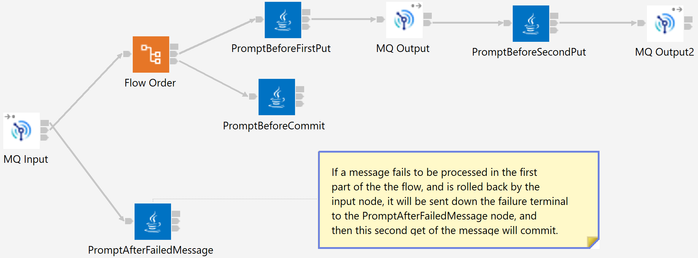

# ace-mq-reconnect
Examples for experiments around ACE and MQ reconnect capabilities.

## ReconnectTests

Each test flow has a separate pair of queues (or a URL and a queue) and is constructed so that it will wait 
for a user to press enter at various points before continuing. The points are:

- Just after a message has been received for the first time from the input queue, before the first MQPUT is attempted
- For the multiple-put flows, just after the first MQPUT has succeeded, but before the second MQPUT is attempted.
- After all the MQPUTs have succeeded, but before MQCMIT is attempted
- For transactional flows, just after a backed-out message has been received but before MQCMIT is attempted.

This allows queue managers to be failed over, connections stopped, etc, with full control over the flow timing.

The [create-queues.mqsc](ReconnectTests/create-queues.mqsc) file contains the queue definitions needed by the
various flows. The TransactionalGetMPut flow looks as follows (others are similar):



### Running the flows

Putting a message on a queue (such as `ACE.TRAN.GET.MPUT.IN`) will cause the server to print some messages and
require the enter key to be pressed in order to continue:
```
2022-10-27 15:27:39.593     57 TransactionalGetMPut_PromptBeforeFirstPut received input message; press enter to continue to MQPUT . . .
2022-10-27 15:27:42.581     57 TransactionalGetMPut_PromptBeforeFirstPut continuing
2022-10-27 15:27:42.590     57 TransactionalGetMPut_PromptBeforeSecondPut; press enter to continue to MQPUT . . .
```
and if the connection is broken at this point (assuming reconnect is enabled) then the MQRC_BACKED_OUT 2003 
message will be printed, followed by the failure terminal prompt as the message is retried:
```
2022-10-27 15:28:37.376     57 TransactionalGetMPut_PromptBeforeSecondPut continuing
2022-10-27 15:28:37.517300: BIP2628W: Exception condition detected on input node 'TransactionalGetMPut.MQ Input'.
2022-10-27 15:28:37.517412: BIP2230E: Error detected whilst processing a message in node 'TransactionalGetMPut.PromptBeforeFirstPut'.
2022-10-27 15:28:37.517480: BIP2230E: Error detected whilst processing a message in node 'TransactionalGetMPut.PromptBeforeSecondPut'.
2022-10-27 15:28:37.517552: BIP2230E: Error detected whilst processing a message in node 'TransactionalGetMPut.MQ Output2'.
2022-10-27 15:28:37.517648: BIP2667E: An error occurred in 'TransactionalGetMPut.MQ Output2' when writing message to queue 'ACE.TRAN.GET.MPUT.OUT' on queue manager 'FTEQM'. State = '-1' 'MQW102' '2003' ''
2022-10-27 15:28:37.520     57 TransactionalGetMPut_PromptAfterFailedMessage: received previously-backed-out message; press enter to continue to MQCMIT . . .

2022-10-27 15:28:44.555     57 TransactionalGetMPut_PromptAfterFailedMessage: continuing
```

The HTTP flows can be triggered using curl: `curl http://localhost:7800/HTTPInMPut` would trigger the HTTPInMPut
flow with similar output to that shown above.

## ReconnectDemo

Allows flow and server behavior to be explored without needing keys to be pressed, and is intended 
to be used in conjunction with the blog post at

https://community.ibm.com/community/user/integration/blogs/trevor-dolby/2022/11/16/ace-and-mq-reconnect-as-seen-from-an-http-client

See [ReconnectDemo/README.md](ReconnectDemo/README.md) for more information.
