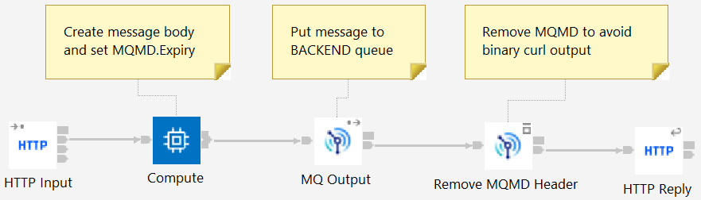

# ReconnectDemo

This application is intended to be used in conjunction with the blog post at
https://community.ibm.com/community/user/integration/blogs/trevor-dolby/2022/11/16/ace-and-mq-reconnect-as-seen-from-an-http-client
and illustrates how MQ's reconnect options change the errors seen by an HTTP
client.

## Main flow

The flow itself looks as follows:

